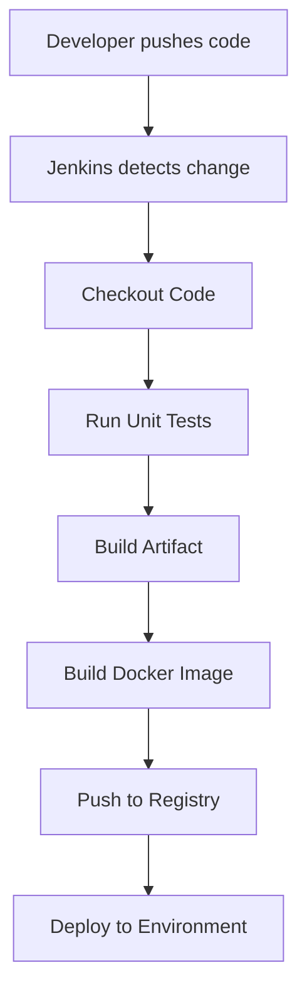

# 📦 Jenkins - Automation for CI/CD + Project work

## 🚀 What is Jenkins?

**Jenkins** is an open-source automation server that helps automate parts of software development related to building, testing, and deploying, facilitating **Continuous Integration (CI)** and **Continuous Delivery (CD)**.

It supports building and deploying any project, in any language, across a variety of platforms.

---

## 🔧 Key Features

* **Pipeline Support**: Automate the end-to-end delivery pipeline using scripted or declarative syntax.
* **Extensive Plugin Ecosystem**: Over 1800 plugins to integrate with most development, testing, and deployment tools.
* **Customizable**: Easily configurable and extendable via custom scripts or shared libraries.
* **Distributed Builds**: Supports master-agent architecture to scale and distribute build/test load.
* **Community-Driven**: Maintained and improved by a vast, active open-source community.

---

## ⚙️ How Jenkins Works

1. **Developer pushes code** to a version control system (e.g., GitHub, GitLab).
2. **Jenkins detects** the change using webhooks or polling.
3. **Pipeline execution** starts automatically:

   * Code is pulled from the repository.
   * Automated tests are executed.
   * The application is built (e.g., compiled to a .jar or Docker image).
   * Artifacts are published or deployed.

---

## 🛠️ Jenkins Use Cases

* Running automated **unit tests**
* Building and deploying **Docker images**
* Automating **Terraform infrastructure deployments**
* Integrating with cloud platforms (AWS, Azure, GCP)
* Notifying teams via **Slack, email**, or other channels

---

## 📊 Jenkins CI/CD Workflow (Visual Diagram)


---

## ✅ Why Use Jenkins?

* Ensures consistent and repeatable builds
* Detects errors early through automated testing
* Speeds up delivery of new features to users
* Seamless integration with many DevOps tools
---


# 🚀 Jenkins CI/CD Pipeline for Java Application with Docker


This project defines a **Jenkins pipeline** to automate the CI/CD process for a Java-based web application. It includes compilation, Docker image creation, pushing to Docker Hub, and deployment via a shared library.

---

## 📁 Project Structure

```
├── Jenkinsfile               # Main Jenkins pipeline configuration
├── script.groovy            # Shared deployment logic
└── jenkins-shared-library/  # Jenkins shared library (referenced in the pipeline)
```

---

## 🔧 Prerequisites

To run this pipeline:

* Jenkins installed with:

  * **Pipeline Plugin**
  * **Docker Pipeline Plugin**
  * **Shared Libraries configured**
* Maven and Docker installed on Jenkins agent
* Jenkins credentials set up for Docker Hub (if private repo)
* Docker Hub account

---

## 📦 What This Pipeline Does

1. 🧪 **Builds the Java App** using Maven.
2. 📦 **Creates a JAR** file.
3. 🐳 **Builds a Docker Image** from the JAR.
4. 📤 **Pushes the Image** to Docker Hub.
5. 🚀 **Deploys the App** using a custom shared script.

---

## 🗺️ CI/CD Pipeline Flow

```text
     ┌──────────────┐
     │  Developer   │
     └─────┬────────┘
           │
           ▼
     ┌──────────────┐
     │   Jenkins    │
     │   Pipeline   │
     └────┬─┬─────┬─┘
          │ │     │
          │ │     └────────┐
          │ ▼              ▼
     ┌─────────┐      ┌────────────┐
     │  Build  │      │   Deploy   │
     │   JAR   │      │   App      │
     └─────────┘      └────────────┘
          │
          ▼
     ┌────────────┐
     │  Docker    │
     │  Image     │
     └────┬───────┘
          ▼
     ┌────────────┐
     │ Docker Hub │
     └────────────┘
```

---

## 🔨 Jenkinsfile Overview

```groovy
#!/user/bin/env groovy
@Library('jenkins-shared-library')_
def gv

pipeline {
    agent any
    tools {
        maven 'Maven'
    }
    stages {
        stage("init") {
            steps {
                script {
                    gv = load "script.groovy"
                }
            }
        }
        stage("build jar") {
            steps {
                script {
                    buildJar()
                }
            }
        }
        stage("build and push image") {
            steps {
                script {
                    buildImage 'dancedevops/my-app:jma-1.2.3'
                    dockerLogin()
                    dockerPush 'dancedevops/my-app:jma-1.2.3'
                }
            }
        }
        stage("deploy") {
            steps {
                script {
                    gv.deployApp()
                }
            }
        }
    }
}
```

---

## 🔧 Custom Shared Functions

Defined in `script.groovy` or Jenkins Shared Library:

| Function        | Description                              |
| --------------- | ---------------------------------------- |
| `buildJar()`    | Compiles and packages Java app as `.jar` |
| `buildImage()`  | Builds Docker image from the JAR         |
| `dockerLogin()` | Authenticates Docker Hub login           |
| `dockerPush()`  | Pushes image to Docker Hub               |
| `deployApp()`   | Deploys containerized app (custom logic) |

---

## 🚀 Usage Instructions

1. Clone this repo to your Jenkins job workspace.
2. Ensure shared library `jenkins-shared-library` is defined in Jenkins.
3. Configure required credentials (e.g., Docker Hub).
4. Click **Build Now** in Jenkins.
